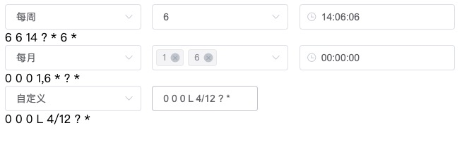

# vue-cron

目前市面上的 Cron 表达式相对复杂，可是实际场景中用不到太过复杂的，故开发此组件。

特点

- 使用简单
- 易于理解

# 安装

```
npm install @xiaofei.wang/vue-cron
// 或
yarn add @xiaofei.wang/vue-cron
```

# api

| 参数         | 说明                 | 类型            | 默认值 |
| ------------ | -------------------- | --------------- | ------ |
| defaultValue | 指定默认值           | String          | -      |
| value        | 指定当前 Cron 值     | String          | -      |
| onChange     | 修改 Cron 调用此函数 | function(value) | -      |
| multiple     | 是否可以多选         | Boolean         | -      |

# 示例

<div align="left">
    
</div>

```
<template>
  <div id="app">
    <cron v-model="value1" />
    {{ value1 }}
    <cron v-model="value2" multiple />
    {{ value2 }}
    <cron v-model="value3" />
    {{ value3 }}
  </div>
</template>

<script>
import cron from "@xiaofei.wang/vue-cron";

export default {
  name: "app",
  data() {
    return {
      value1: "6 6 14 ? * 6 *",
      value2: "0 0 0 1,6 * ? *",
      value3: "0 0 0 L 4/12 ? *"
    };
  },
  components: {
    //注册插件
    cron
  }
};
</script>

```
